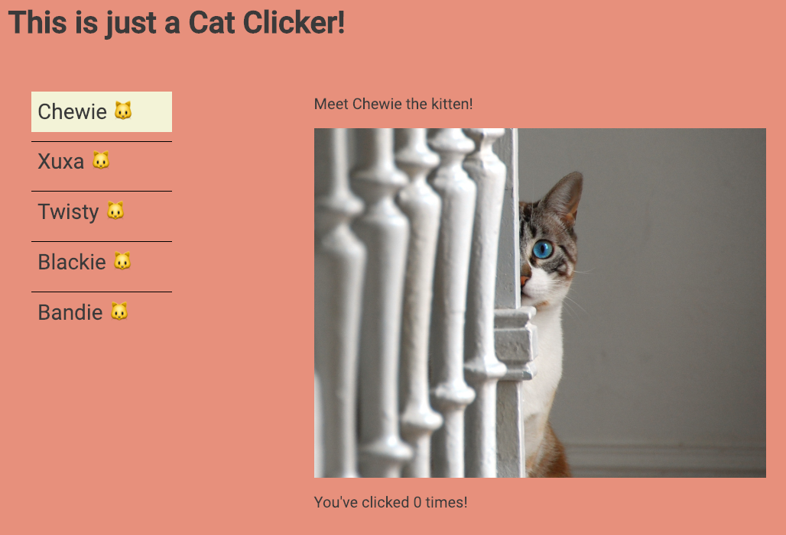

## Cat Clicker

### Contexto 

Esta es la clásica aplicación llamada Cat Clicker!

### Cómo funciona

Simplemente del menú elige el nombre de tu gato favorito para ver su foto y clicarla tantas veces cómo quieras! 🐱

### Para trabajar el kata/requerimientos:

Haremos un menú (dónde quieras en la pantalla), y partimos de una vista en la que sólo el menú (y quizá un título) se vea.

Cuando se clique en cualquier nombre de gato del menú, aparecerá (dónde quieras en la pantalla) la foto del gato, un título como por ejemplo "Conoce al gato `{nombre.gato}`" y un marcador del nº de clicados (mira screen-shot de la app como referencia). 

Los links los hemos cogido de [flickr.com](https://www.flickr.com/photos/poplinre/624194179/in/photostream/), elige las fotos de gatos que más te gusten!!

Estilos: trabaja con la `font-family` que quieras; igual con los colores, tamaños, etc. Trata de hacer una aplicación `responsive`. Añade las `media queries` que consideres. 

Puedes trabajar en Codepen o en local con tus 3 archivos (HTML, CSS, script.js), elige la que más te guste!
Preferimos evitar cualquier el uso de jQuery ;)

### Referencias:

Trabajaremos la manipulación del DOM, eventos/delegación de eventos y una función sencilla que hace que el contador aumente cada vez que clicamos la foto del gato y que vuelva a cero cuando el nombre del gato en el menú se vuelva a elegir.

⚠️ Imp! Las mentoras de las Node Girls Madrid hemos elegido este ejercicio para que no solo trabajemos con el DOM y eventos, sino también el ser capaces de hacer una aplicación escalable, de tal manera que si nos pidieran añadir más gatos y fotos (urls), el código se modifique lo menos posible.

Que este código que sirva sólo como referencia. Está refactorizado con ES6 y hemos usado dataset. Hay muchas formas de hacerlo, elige la tuya! 

Si quieres, puedes tratar de documentar la función que tendrás del contador. Mira los links que añadimos!!

- [Atributos data](https://cybmeta.com/los-atributos-data-y-el-dataset-api)
- [Delegación de eventos](https://ed.team/blog/como-usar-la-delegacion-de-eventos-en-javascript)
- [ES6 by Carlos Azaustre](https://carlosazaustre.es/ecmascript6/)
- [Js docs](http://usejsdoc.org/)

#### Original features
- ES6
- Events and event delegation
- Template string
- Dataset attribute
- Code documented with Js Docs
- Everything follows the Udacity Js/HTML/CSS guidelines
- External dependencies: Google fonts
